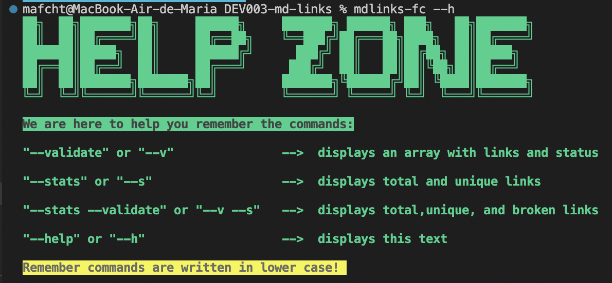

# MARKDOWN LINKS

## Content

* [1. Introduction](#1-introduction)
* [2. Developing Process](#2-developing-process)
* [3. Usage Instructions](#3-usage-instructions)
* [4. Dependencies](#4-dependencies)
* [5. Checklist](#5-checklist)
***

## 1. Introduction
[Markdown](https://es.wikipedia.org/wiki/Markdown) is a lightweight markup language that is very popular among developers. It is used in many platforms that handle plain text (GitHub, forums, blogs, ...) and it is very common to find several files in that format in any type of repository (starting with the traditional `README.md`).

These `Markdown` files normally contain _links_ (links/leagues) that are often broken or no longer valid and that greatly undermines the value of the information that is to be shared.

This project was developed to create a tool using [Node.js](https://nodejs.org/), that reads and analyzes files in `Markdown` format, to verify the links they contain and report some statistics.

Feel free to download the module named `mdlinks-fc` from NPM  [here](https://www.npmjs.com/package/md-links-fc).

## 2. Developing Process
This project was developed in 4 sprints, each sprint has specific actions to implement for the final goal of creating a command line tool (CLI) using Node. It is important to mention that it was built with different libraries and dependencies from `npm`. 
### 1st Sprint

* Planning Trello and GitHub
* Flow Diagram 

* Read documentation
* Deciding the use of ES Modules or CommonJS Modules
* Read a file

### 2nd Sprint

* Read the content of a directory
* Verify the extension of a file
* Search for the `.md` extension 

### 3rd Sprint

* Join two paths
* Create mdlinks function using promises
* Use recursion in functions

### 4th Sprint

* Unit testing
* Develop CLI
* Develop `README.md`

## 3. Usage Instructions

### 1) Installing package

You can use `npm i md-links-fc` or `npm install md-links-fc` to install the package in your terminal.

Example:

## 2) Using package in CLI (Command Line Interface)

**`mdlinks-fc`**

**How to start?**

If the user only types `mdlinks-fc` without any path or option in the terminal, the module should show a welcome message, with the usage instructions where it explains how to use the module and the actions it can make with the given input, such as displaying the statistics and validate links. 

Example:

Our application executable should be able to run through the terminal with the following command:
`mdlinks-fc <path-to-file> [options]`

If you don’t add any options, and only type the following command in the terminal, it should only show you an array of the links that the package found in the path.

`mdlinks-fc <path-to-file>`

Example:

**Options**

**`--validate`**

If we type the `--validate` option after the path, the module should make an HTTP request to find out if the links found work or not. It will show you the status of each link and a message so you as a user know if each link is OK or if it FAILS. You can type the following command:

`mdlinks-fc <path-to-file> -- validate` or `mdlinks-fc <path-to-file> -- v `

Example:

We see that the output, in this case, includes the word `ok` or `fail` after the URL, as well as the status of the response received to the HTTP request to that URL.

**`--stats`**
If we pass the `--stats` option the output will be a text with basic statistics about the links. You can type the following command:

`mdlinks-fc <path-to-file> -- stats` or `mdlinks-fc <path-to-file> -- s`

Example:

**`--stats --validate`**

You can also combine `--stats` and `--validate` to get statistics that need the validation results. You can type the following command:

`mdlinks-fc <path-to-file> -- stats --validate` or `mdlinks-fc <path-to-file> -- s --v`

Example:

**`--help`**

Finally, if you forget the commands and need help remembering them, you can type the following command to ask for help:

`mdlinks-fc -- help` or `mdlinks-fc -- h`

Example:

## 4. Dependencies

* Node.js: used to develop the library.
* NPM: used for managing dependencies
* Chalk: used for styles and colors.
* Figlet: used to style the font for titles.
* Fetch: used for HTTP requests.
* Markdown it: used to convert text to HTML format. 
* JSOM: used to recreate and manipulate objects in the DOM
* Jest: used for unit tests.

## 5. Checklist

The project successfully complies with all the requirements that Laboratoria asked for. 

### General

* [ X] Can be installed via `npm install --global <github-user>/md-links`

### `README.md`

* [X ] A dashboard with the backlog for the implementation of the library.
* [X ] Technical documentation of the library.
* [X ] Guide to using and installing the library

### API `mdLinks(path, options)`

* [X ] The module exports a function with the expected interface (API).
* [ X] Implement single-file support
* [ X] Implement directory support
* [ X] Implements `options.validate`

### CLI

* [ X] Expose the `md-links` executable in the path (configured in `package.json`)
* [X ] Executes without errors / expected output
* [X ] Implements `--validate`
* [X ] Implements `--stats`

### Evidence

* [X ] Unit tests cover a minimum of 70% of declarations, functions, lines, and branches.
* [X ] Tests pass (and linters) (`npm test`).

